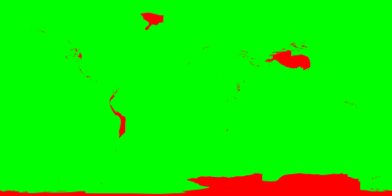
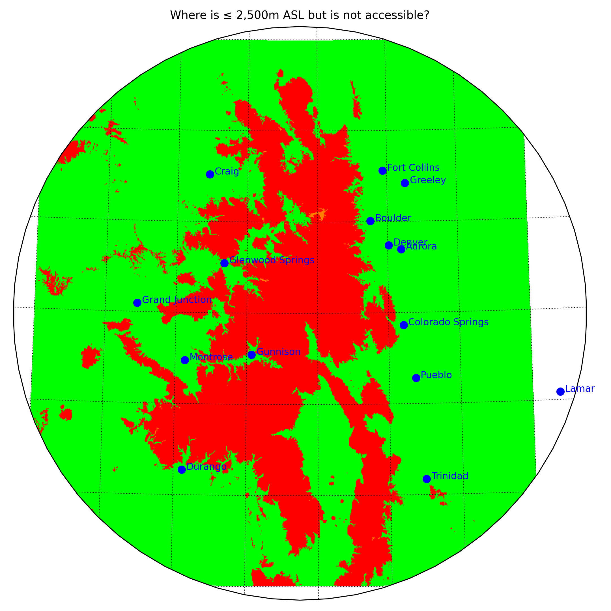
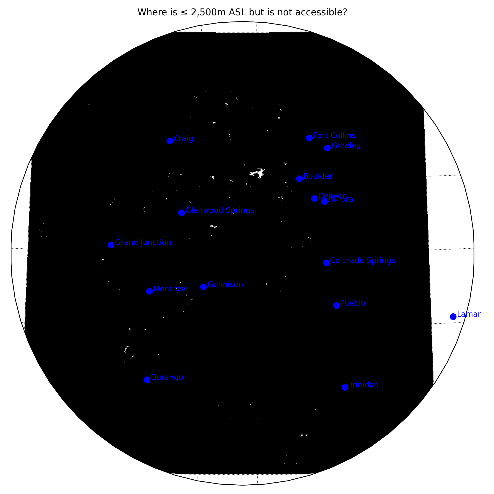
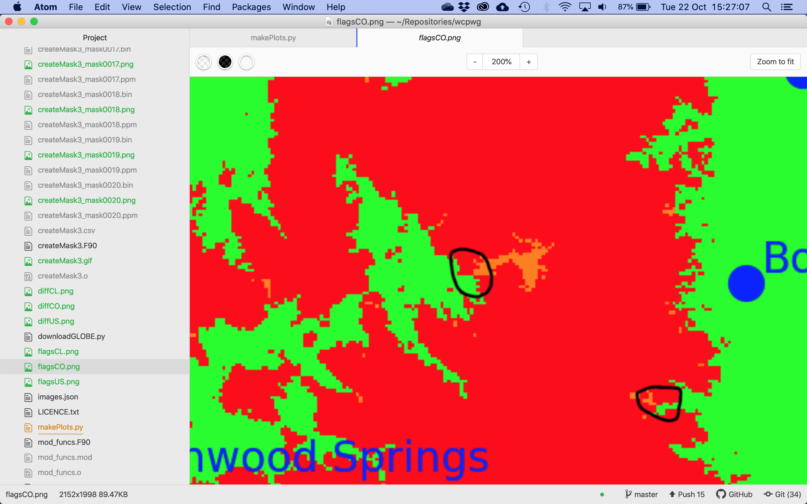
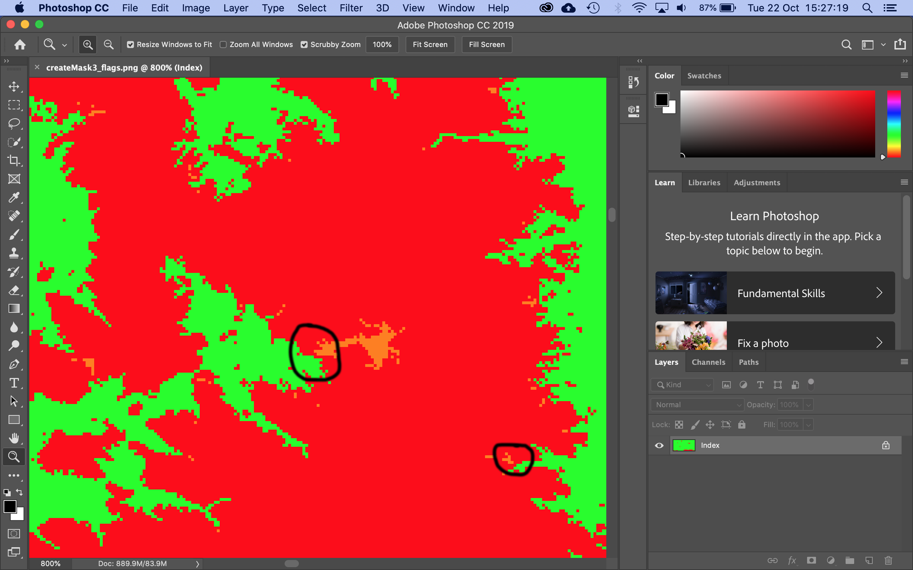

# Where Can Pregnant Women Go? (WCPWG)

This all started after reading the [NHS guidance on exercise in pregnancy](https://www.nhs.uk/conditions/pregnancy-and-baby/pregnancy-exercise/).

## Workflow

1. Download the [GLOBE](https://www.ngdc.noaa.gov/mgg/topo/globe.html) dataset (by running [downloadGLOBE.py](downloadGLOBE.py))
2. Convert the ZIP file of the [GLOBE](https://www.ngdc.noaa.gov/mgg/topo/globe.html) dataset to a BIN file (by running [convertZIPtoBIN.py](convertZIPtoBIN.py))
3. Compile the FORTRAN programs (by running [compile.sh](compile.sh))
4. Create the boolean mask (by running any of: [createMask1.F90](createMask1.F90), [createMask2.F90](createMask2.F90) or [createMask3.F90](createMask3.F90))
    * [createMask1.F90](createMask1.F90) applies the algorithm globally and loops until no more pixels are masked (or `nmax` is reached)
    * [createMask2.F90](createMask2.F90) applies the algorithm globally **then on tiles** and loops **over both stages** until no more pixels are masked (or `nmax` is reached)
    * [createMask3.F90](createMask3.F90) is the same as [createMask2.F90](createMask2.F90) but has extra output to make a pretty blog post
5. Compare the output between versions (by running `join -t, createMask1.csv createMask2.csv > createMask.csv`)
6. Compare the masks and summarise the study (by running [compareMasks.F90](compareMasks.F90))
7. Convert all generated PBM images to PNG images (by running [convertPBMtoPNG.sh](convertPBMtoPNG.sh))
8. Convert all generated PPM images to PNG images (by running [convertPPMtoPNG.sh](convertPPMtoPNG.sh))
9. Convert the sequence of PPM images to a GIF image (by running `convert createMask3_mask????.ppm createMask3.gif`)
10. Make plots (by running [makePlots.py](makePlots.py))

## Method

For each pixel, the FORTRAN programs check if the pixel is less than 2,500m ASL *and* if the pixel is next to a pixel that is accessible; if both checks are true then the pixel is marked as accessible. The FORTRAN programs continue looping over the entire world until no new pixels are marked as accessible. Below is an animation of how this looks.



## Output

The output of [compareMasks.F90](compareMasks.F90) is:

```
93.802373% of the world is <= 2,500m ASL
93.800614% of the world is accessible
```

Note that the second number is smaller than the first, thus indicating that *some* of the pixels that are less than 2,500m ASL are not accessible by land/sea. Examples of places that are less than 2,500m ASL but which are not accessible can be found in Colorado (US), shown in orange below.





## Dependencies

WCPWG requires the following Python modules to be installed and available in your `PYTHONPATH`.

* [cartopy](https://pypi.org/project/Cartopy)
* [matplotlib](https://pypi.org/project/matplotlib)
* [numpy](https://pypi.org/project/numpy)
* [pyguymer3](https://github.com/Guymer/PyGuymer3)
* [requests](https://pypi.org/project/requests)

WCPWG uses some [Natural Earth](http://www.naturalearthdata.com/) resources via the [Cartopy](http://scitools.org.uk/cartopy/) module. If they do not exist on your system then Cartopy will download them for you in the background. Consequently, a working internet connection may be required the first time you run WCPWG.

## To Do

* Obviously, the [compile.sh](compile.sh) needs to be replaced by a real Makefile at some point.

## Bugs

* The algorithm does not cross the meridian. Therefore, if a valley is only accessible by crossing the meridian then this program will incorrectly mark it as inaccessible.
* Due to what I assume is "a rendering error" or "an efficiency saving" in either [cartopy](https://pypi.org/project/Cartopy) or [matplotlib](https://pypi.org/project/matplotlib), some of the plots produced by [makePlots.py](makePlots.py) have green pixels touching orange pixels. The whole point of this project is to find the places in the world where green pixels and orange pixels are separated by red pixels. If a green pixel touches an orange pixel then the orange pixel should be green. I am convinced that this is not my fault and that my code is calculating the arrays correctly - it is purely a rendering error. Below are two screenshots: a) the first is a zoom in on a plot using Atom; and b) the second is a zoom in on a background image using Photoshop. Photoshop shows the green and orange separated by red, so I am happy that it is just a rendering error in either [cartopy](https://pypi.org/project/Cartopy) or [matplotlib](https://pypi.org/project/matplotlib).




