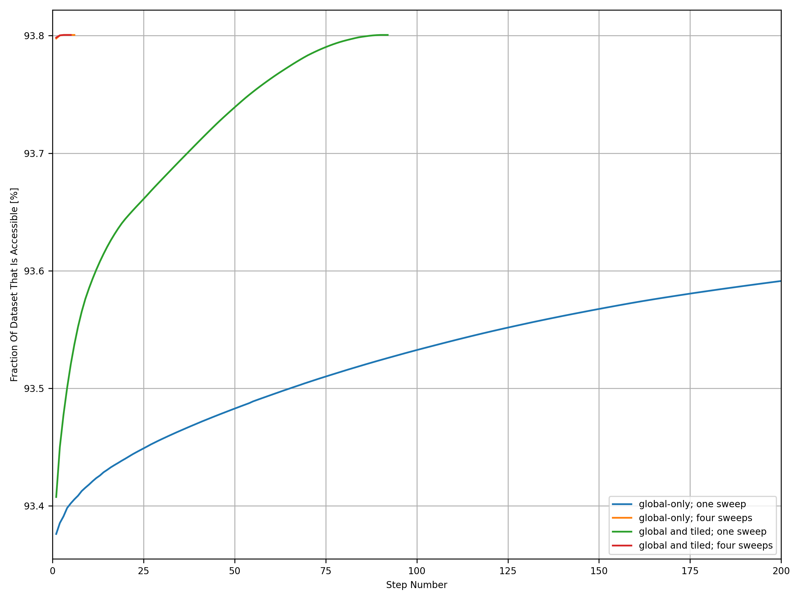

# Where Can Pregnant Women Go? (WCPWG)

  

This all started after reading the [NHS guidance on exercise in pregnancy](https://www.nhs.uk/conditions/pregnancy-and-baby/pregnancy-exercise/).

## Workflow

1. Download the [GLOBE](https://www.ngdc.noaa.gov/mgg/topo/globe.html) dataset (by running [step1_downloadGLOBE.py](step1_downloadGLOBE.py))
2. Convert the ZIP file of the [GLOBE](https://www.ngdc.noaa.gov/mgg/topo/globe.html) dataset to a BIN file (by running [step2_convertZIPtoBIN.py](step2_convertZIPtoBIN.py))
3. Compile the FORTRAN programs (by running [src/Makefile](src/Makefile))
4. Create the boolean mask (by running any of: [src/createMask1](src/createMask1.F90), [src/createMask2](src/createMask2.F90) or [src/createMask3](src/createMask3.F90))
    * [src/createMask1](src/createMask1.F90) applies the algorithm globally and loops until no more pixels are masked (or `nmax` is reached)
    * [src/createMask2](src/createMask2.F90) applies the algorithm globally **then applies the algorithm on tiles** and loops **over both stages** until no more pixels are masked (or `nmax` is reached)
    * [src/createMask3](src/createMask3.F90) is the same as [src/createMask2](src/createMask2.F90) but has extra output to make a pretty blog post
5. Compare the output between versions (by running `join -t, createMask1.csv createMask2.csv > createMask.csv`)
6. Compare the masks and summarise the study (by running [src/compareMasks](src/compareMasks.F90))
7. Convert all generated BIN files to PNG images (by running [step7_convertBINtoPNG.py](step7_convertBINtoPNG.py))
8. Convert the sequence of PNG images to a MP4 video (by running [step8_convertPNGtoMP4.py](step8_convertPNGtoMP4.py))
9. Convert the sequence of PNG images to a WEBP animation (by running [step9_convertPNGtoWEBP.py](step9_convertPNGtoWEBP.py))
11. Make plots (by running [step11_makePlots.py](step11_makePlots.py))
12. Confirm updated behaviour (by running [step12_convergence.py](step12_convergence.py))

## Method

For each pixel, the FORTRAN programs check if the pixel is less than 2,500m ASL *and* if the pixel is next to a pixel that is accessible; if both checks are true then the pixel is marked as accessible. The FORTRAN programs continue looping over the entire world until no new pixels are marked as accessible. Below is an animation of how this looks.


## Output

The output of [src/compareMasks](src/compareMasks.F90) is:

```
93.802373% of the world is <= 2,500m ASL
93.800614% of the world is accessible
```

Note that the second number is smaller than the first, thus indicating that *some* of the pixels that are less than 2,500m ASL are not accessible by land/sea. Examples of places that are less than 2,500m ASL but which are not accessible can be found in Colorado (US), shown in orange below.


## Update (December 2024)

I have genericised the `incrementMask` subroutine and its surrounding iteration loop, as it is also used in the [RSL project](https://github.com/Guymer/rsl). The new genericised version (for `INT16` 2D arrays) can be found in `fortranlib` [here](https://github.com/Guymer/fortranlib/blob/main/mod_safe/sub_flood_array/sub_flood_INT16_integer_array.f90). The new genericised version allows the user to toggle using tiles (by setting `tileScale = 1_INT64` in the subroutine call), which allows me to easily reproduce the comparison between [createMask1](src/createMask1.F90) and [createMask2](src/createMask2.F90). However, it appears that the new genericised version converges significantly quicker than the original `incrementMask` subroutine included in this repository.

As can be seen in the animation above, most of the iterations are spent going from east to west to fill in the Taklamakan Desert in China. The new genericised version does four sweeps per iteration:

1. Start top-left and go down then right.
2. Start top-right and go left then down.
3. Start bottom-right and go up then left.
4. Start bottom-left and go right then up.

This improvement means that [createMask1](src/createMask1.F90) (without any tiling) converges in 6 iterations now rather than not converging after 200 iterations. Enabling tiling in [createMask2](src/createMask2.F90) converges in 5 iterations now rather than the 92 iterations it took before - thus showing that the improvement of tiling is much less impactful than the improvement of sweeping in each direction. I will leave [createMask3](src/createMask3.F90) untouched so as to reproduce the animation if anyone wants to.

The old behaviour can be reproduced by:

1. adding a `RETURN` statement to a local copy of [sub_flood_INT16_integer_array_iter](https://github.com/Guymer/fortranlib/blob/main/mod_safe/sub_flood_array_iter/sub_flood_INT16_integer_array_iter.f90) to disable the three new sweeps; and
2. adding `IF(iIter == 200_INT64) EXIT` to a local copy of [sub_flood_INT16_integer_array](https://github.com/Guymer/fortranlib/blob/main/mod_safe/sub_flood_array/sub_flood_INT16_integer_array.f90) to make the iteration give up but return an answer.

This was confirmed on 29/Dec/2024.



## Dependencies

WCPWG requires the following Python modules to be installed and available in your `PYTHONPATH`.

* [cartopy](https://pypi.org/project/Cartopy/)
* [matplotlib](https://pypi.org/project/matplotlib/)
* [numpy](https://pypi.org/project/numpy/)
* [pyguymer3](https://github.com/Guymer/PyGuymer3)
* [requests](https://pypi.org/project/requests/)

Additionally, due to the dependency on [my FORTRAN library](https://github.com/Guymer/fortranlib), you will also require the following Python modules to be installed and available in your `PYTHONPATH`:

* [matplotlib](https://pypi.org/project/matplotlib/)
* [scipy](https://pypi.org/project/scipy/)

WCPWG uses some [Global Self-Consistent Hierarchical High-Resolution Geography](https://www.ngdc.noaa.gov/mgg/shorelines/) resources and some [Natural Earth](https://www.naturalearthdata.com/) resources via the [cartopy](https://pypi.org/project/Cartopy/) module. If they do not exist on your system then [cartopy](https://pypi.org/project/Cartopy/) will download them for you in the background. Consequently, a working internet connection may be required the first time you run WCPWG.

## Bugs

* The algorithm does not cross the meridian. Therefore, if a valley is only accessible by crossing the meridian then this program will incorrectly mark it as inaccessible.
* Due to what I assume is "a rendering error" or "an efficiency saving" in either [cartopy](https://pypi.org/project/Cartopy/) or [matplotlib](https://pypi.org/project/matplotlib/), some of the plots produced by [step11_makePlots.py](step11_makePlots.py) have green pixels touching orange pixels. The whole point of this project is to find the places in the world where green pixels and orange pixels are separated by red pixels. If a green pixel touches an orange pixel then the orange pixel should be green. I am convinced that this is not my fault and that my code is calculating the arrays correctly - it is purely a rendering error. Below are two screenshots: a) the first is a zoom in on a plot using Atom; and b) the second is a zoom in on a background image using Photoshop. Photoshop shows the green and orange separated by red, so I am happy that it is just a rendering error in either [cartopy](https://pypi.org/project/Cartopy/) or [matplotlib](https://pypi.org/project/matplotlib/).


