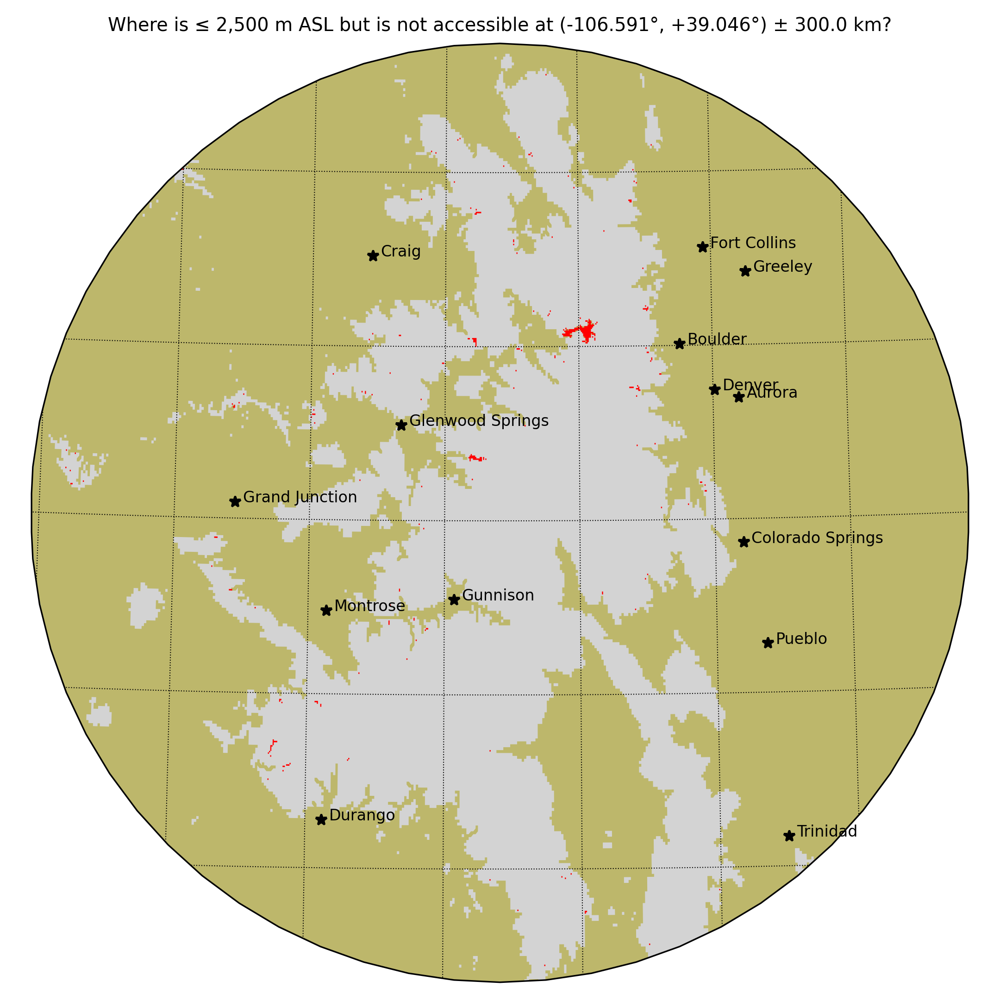

# Where Can Pregnant Women Go? (WCPWG)

  

This all started after reading the [NHS guidance on exercise in pregnancy](https://www.nhs.uk/conditions/pregnancy-and-baby/pregnancy-exercise/).

## Workflow

* Download the ZIP dataset:
    * Run [step0_downloadGlobe.py](step0_downloadGlobe.py) to download the [GLOBE](https://www.ngdc.noaa.gov/mgg/topo/globe.html) dataset.
* Convert the ZIP file to a BIN file (for use by FORTRAN natively):
    * Run [step1_convertZipToBinGlobe.py](step1_convertZipToBinGlobe.py).
* Create the boolean masks and vectorise inaccessible land:
    * Change to the [src](src) directory, compile the FORTRAN program by running `gmake -r` and then run `./step2_createMask`.
* Convert the sidecar BIN arrays to PNG images by running [step3_convertBinToPng.py](step3_convertBinToPng.py).
* Convert the sidecar PGM images to PNG images by running [step4_convertPgmToPng.py](step4_convertPgmToPng.py).
* Convert the LinearRings in HDF files to Polygons in GeoJSON files:
    * Run [step4_convertH5toGeoJsonGlobe.py](step4_convertH5toGeoJsonGlobe.py).
* Check GeoJSON files by running [step6_checkGeoJson.py](step6_checkGeoJson.py).
* Make plots by running [step7_makePlots.py](step7_makePlots.py).

## Output

The FORTRAN program [step2_createMask](src/step2_createMask.F90) will print out:

```
 > 93.802373% of the world is below 2,500 m ASL.
 > 93.800614% of the world is accessible to pregnant women.
 >  0.001759% of the world is inaccessible to pregnant women.
```

The Python script [step7_makePlots.py](step7_makePlots.py) will make:



## Dependencies

WCPWG requires the following Python modules to be installed and available in your `PYTHONPATH`.

* [cartopy](https://pypi.org/project/Cartopy/)
* [matplotlib](https://pypi.org/project/matplotlib/)
* [numpy](https://pypi.org/project/numpy/)
* [pyguymer3](https://github.com/Guymer/PyGuymer3)
* [requests](https://pypi.org/project/requests/)

Additionally, due to the dependency on [my FORTRAN library](https://github.com/Guymer/fortranlib), you will also require the following Python modules to be installed and available in your `PYTHONPATH`:

* [matplotlib](https://pypi.org/project/matplotlib/)
* [scipy](https://pypi.org/project/scipy/)

WCPWG uses some [Global Self-Consistent Hierarchical High-Resolution Geography](https://www.ngdc.noaa.gov/mgg/shorelines/) resources and some [Natural Earth](https://www.naturalearthdata.com/) resources via the [cartopy](https://pypi.org/project/Cartopy/) module. If they do not exist on your system then [cartopy](https://pypi.org/project/Cartopy/) will download them for you in the background. Consequently, a working internet connection may be required the first time you run WCPWG.

## Bugs

* The algorithm does not cross the meridian. Therefore, if a valley is only accessible by crossing the meridian then this program will incorrectly mark it as inaccessible.
